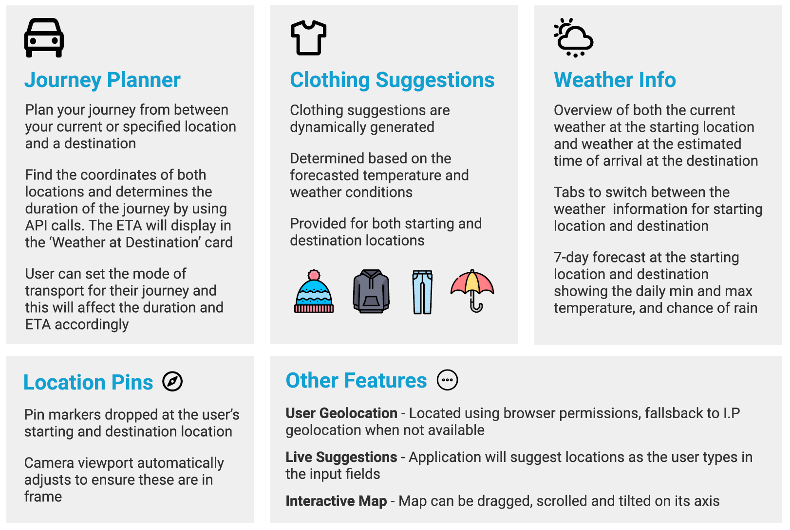
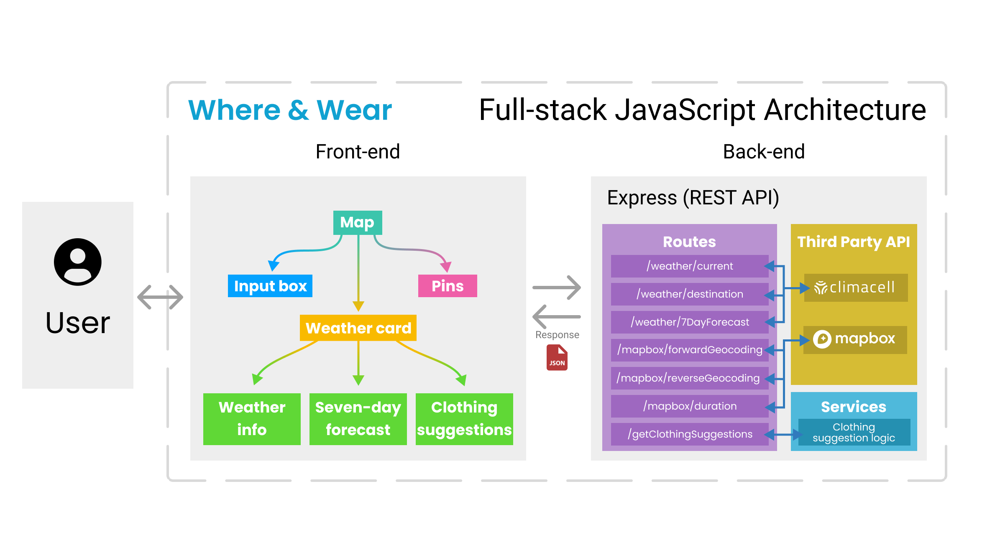

# Where & Wear
A fullstack JavaScript web app to help you decide what to wear on your journey.

## Background
Weather apps often show us the current weather but not the weather at a planned destination. As a University final year project, the aim is to create a web application that can schedule journeys and generate clothing suggestions based on the forecast weather conditions upon arrival at the desired destination.

The application allows users to enter a start and destination location, and then choose from several modes of transport. It then uses this input to determine the duration of the journey and the time of arrival. The application will also display the current weather at the starting location and destination, a 7-day forecast and images of the clothing suggestions to inform the user before they travel.

## Features


## Design choices
For the front-end, React is suitable for creating user interfaces as it breaks down the interface into separate, reusable parts and I can focus on the isolated building blocks known as “components” (Facebook, 2021).

For the back-end choice of technology, I chose Express JS specifically as it is a very popular web framework which is fast and easy to set up and provides many libraries for working with inbound requests.

The front end is completely independent of the backend which provides multiple benefits. This modular approach allows flexibility and extensibility. If I were to develop a native mobile application, I could reuse the same Express backend. If I need to add a database to store and retrieve information, I could simply connect it to the Express app as it supports integration with a variety of database, such as including MongoDB, PostgreSQL, MySQL, and SQLite.

## Technologies used
- React
- Express JS
- Material-UI
- Mapbox (react-map-gl)
- Tomorrow.io (formerly Climacell)

## High-level architecture  


## Configuring
Before getting started on development, you'll need an API key from Mapbox and Climacell.

### Mapbox API Key
First register on [Mapbox](https://account.mapbox.com/auth/signin/?route-to=%22https://account.mapbox.com/%22). You can get your API key if you go to your [Access tokens](https://account.mapbox.com/access-tokens/) page within your account.

### Tomorrow.io (Climacell) API Key
Go to [Tomorrow.io](https://www.tomorrow.io/) and register a developer account. The API key for Tomorrow.io API v4 can be found in the [Development](https://app.tomorrow.io/development/keys) tab

### Setting up `.env` files
Copy both `.env.sample` files in `/frontend` and `/backend` directory, and rename them to `.env`. Paste your own API keys there without the double quotes.
```JavaScript
// frontend/.env
REACT_APP_MAPBOX_API_KEY="Your mapbox api key"
```

```JavaScript
// backend/.env
MAPBOX_API_KEY="Your mapbox api key"
CLIMACELL_API_KEY="Your climacell api key"
```

## Running locally for the first time
Make sure you have [Node.js](https://nodejs.org/en/) installed before running the following command.
```bash
# Go inside front-end directory
cd frontend
# Install front-end dependencies
npm install

# Go inside back-end directory
cd ../backend
# Install back-end dependencies
npm install

# Run the fullstack application for development
npm run dev
```
